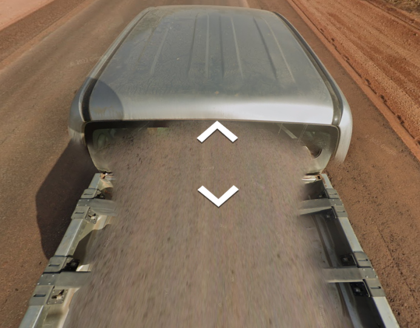
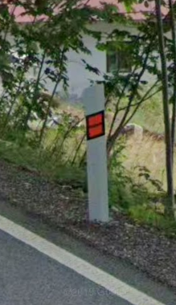
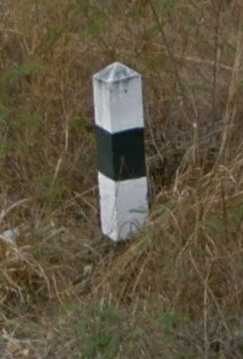
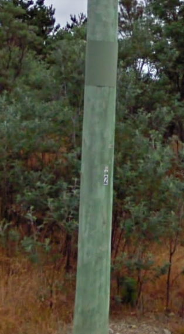

# Languages

**Asia**
- Korean = 타마라
- Japanese = タマラ
- Chinese = 塔马拉
- Vietnamese = mù tạc
- Thai = ทามารา
- Cambodian = តាម៉ារ៉ា
- Indonesian = tamara
- Lao = ທາມາຣາ
- Sri Lanka = තමරා
- Hindi = तमारा
- Singapore = English and Chinese
- Philippins = mustasa, English, Spanish

**Europe**
- Germany = ß
- Dutch, Flemish = z, w, ee, ij
- Swedish = å, ä, ö
- Finnish = ä, aa, ii
- Danish, Norwegian = æ, å, ø
- Estonian = õ, aa, ii
- Latvian = ļ, ķ, ņ, `ā`, ē, ī, ō, ū, ž
- Polish = rz, sz, cz, ó, `ł`, ż, ś, ȩ, ń
- Lithuanian = š, ž, ū, č, `ė`
- Slovak = á, é, í, ý, č, š, ž, ä, `ľ`, `ĺ`, ŕ, ô, `dz`, dž
- Czech = á, é, ý, č, š, ž, `ř`, `ě`, `ů` and lots of z
- Hungarian = é, á, í, ó, ú, ü, ő, ö
- Slovenian = `ž`, š, č and lots of j
- Croatian = `š`, ć, č
- Romanian = ş, ƫ, ă, ȃ
- Turkish = ö, ı, ğ, ş
- Albanian = ë, ç and lots of q and j
- Portuguese = `ã`, ç


## Spanish vs Portuguese

Spanish:
- el, la, los, las
- `ñ`

Portuguese:
- o, a os, as
- `ã`, `õ`, `ç`
- `-ao`

# Car

Features:
- Bars = Guatemala, Faroe, Mongolia, Kyrgyzstan, Kenya, Dominican Republic (black bar inside), US Virgin Islands, Curaçao, Ghana (black tape), Louang Prabang (Lao)
- Black snorkel = Kenya
- French flag colors = Sri Lanka
- Sides of car visible = Uganda
- Toyota following = Nigeria
- Mazda following = Tunisia
- Camping equipment = Mongolia
- Motorbike = Vietnam

Colors:
- Black car = Argentina, Uruguay, Bermuda, Russia
- White cat = Bulgaria

**Ecuador**


**Chile**


**Rwanda**


**Kenya**


**Senegal**

 

**Qatar**


**Ukraine**


**US Virgin Islands**


**Bermuda**


# License plates

- Red = Kyrgyzstan, Isle of Man, Albania
- Yellow = Netherlands, Luxembourg, Colombia, Lao, Israel
- Yellow on the back only = UK
> Ireland has European plates
- White plates = Croatia, Iceland, Switzerland, North Macedonia, San Marino
- Blue on both sides = Italy, Albania
- Blue on the left and yellow on the right = Portugal
- Blue and yellow on the left = Ukraine
- Red text = Belgium
- Red plate = Bhutan
- Black dot in the middle = Argentina
- Black = Indonesia, Malaysia

# Sky

- Rifts = Senegal, Montenegro, Albania, Botswana, Eswatini
- Sun = North → South Hemisphere, South → North Hemisphere

# Driving


# Roads


**Nordic countries** : Sweden, Norway and Iceland  


- Huge highways = Singapore
- Blue highway panels = Europe
- Red outlines on road panels = Denmark
- Use miles = UK, USA, Myanmar

## Signs


## Highways

- Mexico = Increase from NW to SE
    - State highways have the state abbreviation on them
- Brazil = Big highways start with BR
    - 0-100 = Starting at Brasilia
    - 100-200 = North-South
    - 200-300 = East-West
    - 300-400 = Diagonal
        - Odd = SW to NE
        - Even = SE to NW
    - 400-500 = Highway connecting other highways
    - State highways names start with state initials

### Europe

- Odd = North-South (increasing from West to East)
- Even = East-West (increasing from North to South)


- Norway 
    - National Roads [green without E] and county roads [white] first digit increases as follows


- Sweden 
    - National roads [blue] -> increasing from South to North (under 100)
    - County roads [blue] -> increasing from South to North (from 100 to 404)
- Finland
    - Main roads [yellow] increase from South to North (from 50 to 100)
    - Regional roads [white] increase from South to North (from 100 to 999)

- Spain
    - Orange roads


### US

Multi-state highways (white symbol):
- Odd = North-South (increase from East to West) 
- Even = East-West (increase from North to South)
- 3 digits = branch from bigger highway with 2 digits -> **last** 2 digits in common

Inter-state highways (red and blue symbol):
- Odd = North-South (increase from West to East)
- Even = East-West (increase from South to North)
- 3 digits = branch from bigger highway with 2 digits -> **last** 2 digits in common

# Bollards

## Europe

| Bollard    | Countries    |
|---------------- | --------------- |
|  | UK    |
|  | France |
|  | Italy, Albania |
|  | Sardegna |
|  | Spain, Lithuania |
|  | Portugal, Luxembourg, Sweden, Latvia, Germany   |
|  | Netherlands, Romania, Turkey |
|  | Austria, Slovenia, Montenegro, Serbia |
|  | Czech, Slovakia |
|  | Hungaria, Bulgaria, Croatia, North Macedonia |
|  | Poland |
|  | Denmark |
|  | Finland, Estonia (rectangle can be yellow) |
|  | Iceland |
|  | Ukraine |
|  | Russia |

## Asia

| Bollard   | Countries    |
|--------------- | --------------- |
|  | Japan   |
|  | Cambodia |
|  | Thailand |
|  | Malaysia |
|  | Kyrgyzstan |
|  | Mongolia |
|  | Bangladesh |

## America

| Bollard   | Countries    |
|--------------- | --------------- |
|   | Ecuador |
|   | Peru (also different bollards with yellow top) |
|  | Mexico |
|  | Chile |
|  | Argentina |
|   | Uruguay |
|  | Brazil (indicates region initials) |


## Oceania

| Bollard   | Countries    |
|--------------- | --------------- |
|    | Australia |
|  | New Zealand |

# Utility poles

## Asia

| Pole   | Countries    |
|--------------- | --------------- |
|  | Taiwan |
|   | South Korea |
|  | Japan |
|  | Japan (mostly Hokkaido) |
|  | Malaysia (not Borneo) |
|  | Thailand |

## Oceania

| Pole   | Countries    |
|--------------- | --------------- |
|  | Australia (South) |
|  | Australia (Northern Territory) |
|  | Australia (Tasmania) |
|  | New Zealand |

## Europe

| Pole   | Countries    |
|--------------- | --------------- |
|  | Romania |
|  | Hungary (A shape) |
|  | Poland |
|   | Belgium |
|  | Portugal |
|  | Ireland |
|  | Lithuania |
|  | Latvia |
|  | Estonia |
|  | Czechia and Slovakia |
|  | Norway, Sweden and Finland |
|  | Ukraine |
|  | Russia and Ukraine |
|  | Turkey |

## Africa

| Pole   | Countries    |
|--------------- | --------------- |
|  | Nigeria |
|   | Senegal |

## America

| Pole   | Countries    |
|--------------- | --------------- |
|  | Brazil |
|  | Chile |
|  | Peru (can be all colors) |
|  | Ecuador |
|  | Mexico (sometimes Colombia) |
|  | USA and Canada |
|  | Dominican Republic |
|  | Argentina |

# Internet domains

- .cl = Chile
- .co = Colombia
- .de = Germany
- .hr = Croatia
- .ie = Ireland
- .il = Israël
- .im = Isle of Man
- .kh = Cambodia
- .lk = Sri Lanka
- .lv = Latvia
- .me = Montenegro
- .mk = North Macedonia
- .rs = Serbia
- .sk = Slovakia
- .si = Slovenia
- .sl = Sierra Leone
- .ua = Ukraine
- .uy = Uruguay
- .za = South Africa

# Phones

(54)-XXXX-XXXX -> 54  


04 XX XX XX XX -> 04  


(30) XXXX-XXXX -> 30  


(+62) 21-XXXX-XXXX or (021) XXX-XXXX -> 02  


05 XXXXXXXX -> 05  


499 XXX-XX-XX -> 499  


(+46) 70-XXX-XXXX or 070-XXX-XXXX -> 07  


(+81) 013 XXXX-XXXX -> 13  


8XXXXXXXXX -> 8  


044-XXXXXX -> 044  


8XXXXXX -> 8  


# Camera

Generations:
- 1 = horrible quality
- 2 = halo in the sky
- 3 = decent quality
- 4 = good quality


# Vegetation

`Hokkaido cabbage` found on Sakhalin island and Hokkaido


`Eucalyptus` everywhere in Peru


`Pampa` around Buenos Aires and Santa Fe


`Oil palm plantations` around Belem in Brazil


`Banana plantation` north of Guayaquil in Ecuador


# Parts of the world

## North America

Bermuda:
- White roofs
- Black truck
- Palm trees

Mexico:
- Flat roofs
- Octagonal concrete electricity poles
- Single solid yellow center line
- Gen 2
- Concrete houses
- Uses ALTO on stop signs

Guatemala:
- Uses ALTO on stop signs
- Bars on cars

Puerto Rico:
- Green distance markers every 100m indicating distance to San Juan
- No front license plate  


Canada:
- Horizontal planks
- `Maximum` speed signs

USA:
- Gen 1 camera
- `Speed limit` signs
- Uses miles

## South America

Curacao:
- Bars on cars
- Dutch as national language

Colombia:
- Yellow car plates
- Cross on the back of traffic signals
- "Floating bush" tree
- Carrera/calle street system
- Corrugated iron roofs

Ecuador:
- Many holes in electric poles
- US dollars
- Grey bricks
- Very rare red bricks

Peru:
- Zebra poles
- Unpainted brick houses
- Brown small bricks
- Currency `S/`
- Streets are called Jiron (Jr.)
- Tuk tuks
- `Eucalyptus` trees

Bolivia:
- Unpainted brick houses
- Red large bricks
- Currency `Bs`
- Wooden posts

Brazil:
- Red soil = Near Sao Paulo
- Black on back of road signs
- High holes in electric poles

Chile:
- Andes to the East
- High hollow portion of electric poles
- Black street plates in cities
- Painted wood
- All white road lines
- All yellow road lines in the very south

Argentina:
- Yellow centre alongside dashed white
- Blue street plates in cities
- Double yellow lines have no white dashes in between
- Thin metal sign posts
- No bollard
- Black car
- Black dot in the middle of the license plate
- `Pampa` vegetation

Uruguay:
- Yellow centre alongside dashed white
- Double yellow road lines will always have a white dash in between
- Thick white wooden sign posts
- Bad weather
- Black car

## Middle East

Jordan:
- Black reared car
- South African roads
- Zebra poles

## East Asia

Bhutan:
- Red plates


Thailand:
- Driving on the left
- Large tile roof

Cambodia:
- Driving on the right
- Elevated on posts

Indonesia:
- Driving on the left
- Cigarettes advertising everywhere
- Tons of scooters
- Brown tiles or iron roof for Borneo mostly
- Money = `Rp`
- Black license plates

```
North – Utara
East – Timur
West – Barat
South – Selatan
Central – Tengah
Southeast – Tenggara
```

Malaysia:
- Driving on the left
- Developed
- Plenty of road signs
- Black and white road curbs
- Bridges have area initials
- Columns to support part of the house
- Money = `RM`
- Black license plates

Philippins:
- Driving on the right
- Spanish
- Corrugated iron roofs

Japan:
- Driving on the left

Taiwan:
- Driving on the right
- Boxy shape houses

## Europe

Turkey:
- Houses on top of hills

### German speaking

Austria:
- White road signs

Germany:
- Yellow road signs
- Blurred rectangles

### English speaking

Jersey:
- Roads like south africa
- French and English
- Gen 2

Netherlands:
- Flat or extremely steep roofs
- Yellow license plates

### Baltic countries

Grey roof

Latvia:
- Bus signs with 5 windows


Estonia:
- Bus sign with 4 windows
- White flowers


Lithuania:
- Bus sign with 4 windows


### Center

Czechia:
- Skoda cars
- Rolling hills
- Street = `ulice` (almost never written)


Hungary:
- Low one story roof
- Street = `utca`

Slovakia:


Slovenia:


Poland:


### Russian speaking

Serbia:
- Fairly run down

Russia:
- Black car

Bulgaria:
- White car

Ukraine:
- Blue and yellow on the left of license plates
- Red car

### Coast

Albania:
- Red license plates
- Unfinished two stories
- Rifts in the sky

## Africa

Kenya:
- South African roads possible
- Black snorkel
- Bars on cars

Senegal:
- Crumbling brick buildings
- Rifts in the sky

South Africa:
- High fences
- Gen 2 camera
- Yellow on the sides of the road

Lesotho:
- No gen 2 camera
- No trees
- Yellow on the sides of the road

Eswatini:
- No gen 2 camera
- Trees
- Green
- Yellow on the sides of the road

Botswana:
- No gen 2 camera
- Desert
- Rifts in the sky
- Yellow on the sides of the road

## Oceania

New Zealand:
- White houses

Australia:
- Gen 1 camera
- `Hungry Jack's` fast-food
- Buses designs:

New South Wales


Queensland


Victoria (can also be green)


Norther territory


Adelaide


## Islands

Midway Atoll:
- Birds everywhere

Isle of Man:
- Red plates

US Virgin Islands:
- Short bars on car

Christmas Island:
- Metal trailer


